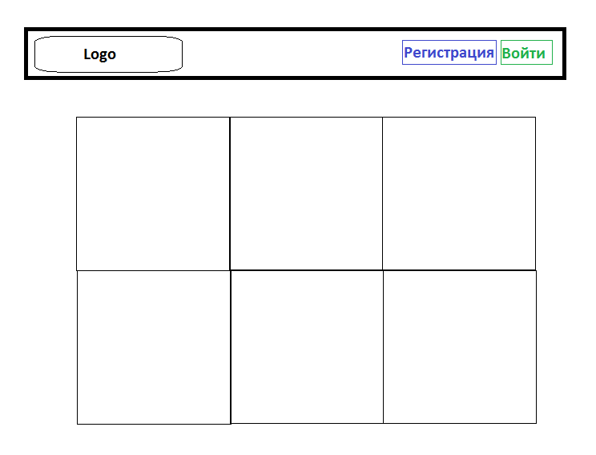

<h1 align="center">Technical Task</h1>

## Project Name

#### Интернет-магазин плюшевых игрушек

## Team Lead & Project Developers & Teacher

#### Замышляев В.И.; Замышляев А.И.; Анатольев А.В.

## Description of the Program
#### Интернет магазин плюшевых игрушек должен иметь простой и понятный интерфейс. Главная страница сайта представляет собой каталог магазина. Пользователь выбирает товар и кладёт его в корзину.

- **Личный кабинет (регистрация/авторизация)**
- **База Данных (пользователи/товары)**
- **ORM-модели**

## Project Description

#### Два основных класса: _User_ и _Product_. Они отвечают за данные пользователя и данные продукта соответственно. В данном проекте имеется множество функций, отвечающих за удаление товаров из корзины, изменение их количества.
#### В базе данных проекта хранятся две таблицы: _users_ и _products_. В таблице _users_ хранятся данные о пользователе: _id, имя, электронная почта, пароль, дата создания аккаунта и корзина покупателя_. В таблице _products_ хранятся данные о товаре: _id, название и id пользователей, которые добавили данный товар себе в корзину._

## Program Code Plan

#### В проекте используются библиотеки _flask, flask_login, sqlalchemy, datetime, flask_wtf, wtforms_. Глобальные переменные не нужны, т.к. вся обрабатываемая информация берется из БД.

## Graphical Interface

## Deadlines

#### Разработка проекта займет 1,5 месяца.
- **Личный кабинет - 1 неделя**
- **База Данных - 1 неделя**
- **ORM-модели - 1 неделя**
- **Другое - 3 недели** 
